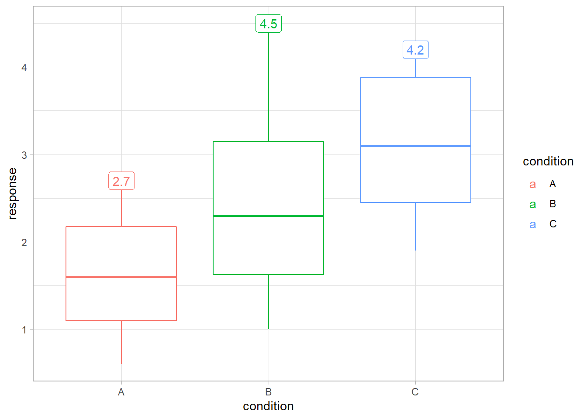

<!-- README.md is generated from README.Rmd. Please edit that file -->

# ggbuilder: A pipe-like approach to building individual ggplot layers

{ggbuilder} is *experimental* alternative approach to specifying
individual [ggplot2](https://ggplot2.tidyverse.org/) layers. It was
inspired by an observation made by June Choe in his [RStudio::conf 2022
talk](https://twitter.com/yjunechoe/status/1552658547867017217?s=20&t=eC4R9YVtf51Fa8k_GTySUw):
some elements of a layer specification (i.e. calls to `geom_XXX()` or
`stat_XXX()`) tend to be written out-of-order compared to how those
elements are actually executed by ggplot2, which may make it hard to
reason about. {ggbuilder} provides an alternative syntax for specifying
layers that mimics familiar data transformation pipelines, and attempts
to put operations in the same order syntactically as they are actually
executed.

## Installation

You can install the development version of ggbuilder from
[GitHub](https://github.com/) with:

``` r
# install.packages("devtools")
devtools::install_github("mjskay/ggbuilder")
```

## Example

Here is a simple dataset, visuallized using normal ggplot2 syntax:

``` r
library(ggplot2)
library(ggbuilder)
library(dplyr)
theme_set(theme_light())

set.seed(123456)
df = data.frame(condition = c("A", "B", "C"), response = round(rnorm(30, 1:3), 1))
df |>
  ggplot(aes(x = condition, y =  response, color = condition)) +
  geom_point()
```


Or you might try use a boxplot instead (though personally I would
probably use something from [ggdist](https://mjskay.github.io/ggdist/)
instead ;) )

``` r
df |>
  ggplot(aes(x = condition, y =  response, color = condition)) +
  geom_boxplot(size = 0.75)
```


To translate the above to {ggbuilder}, we can start by replacing calls
of the form `geom_XXX(...)` or `stat_XXX(...)` with `geom_("XXX", ...)`
or `stat_("XXX", ...)`. These will work just as before:

``` r
df |>
  ggplot(aes(x = condition, y =  response, color = condition)) +
  geom_("boxplot", size = 0.75)
```


It works just as before, except that the objects created by calls to
`geom_()` and `stat_()` are both traditional ggplot2 layers *and*
ggbuilder layer *specifications*, which can be chained together using
the pipe: `|>`.

``` r
geom_("boxplot", size = 0.75)
#> <ggbuilder::layer>:
#> mapping:  
#> geom_boxplot: outlier.colour = NULL, outlier.fill = NULL, outlier.shape = 19, outlier.size = 1.5, outlier.stroke = 0.5, outlier.alpha = NULL, notch = FALSE, notchwidth = 0.5, varwidth = FALSE, na.rm = FALSE, orientation = NA
#> stat_boxplot: na.rm = FALSE, orientation = NA
#> position_dodge2 
#> 
#> from <ggbuilder::layer_spec>:
#> $params
#> $params$size
#> [1] 0.75
#> 
#> 
#> $mapping_stat
#> Aesthetic mapping: 
#> <empty>
#> 
#> $mapping_geom
#> Aesthetic mapping: 
#> <empty>
#> 
#> $mapping_final
#> Aesthetic mapping: 
#> <empty>
#> 
#> $geom
#> [1] "boxplot"
```

This allows us to replicate an example from June Choe’s talk in which
the boxplot stat is reused with a label geometry instead of its normal
boxplot geometry.

**In ggplot2**, this requires using `after_stat()` to reassign the y
aesthetic after `stat_boxplot()` does its computation:

``` r
df |>
  ggplot(aes(x = condition, y = response, color = condition)) +
  geom_boxplot() +
  geom_label(
    stat = "boxplot", 
    aes(y = stage(response, after_stat = ymax), label = after_stat(ymax))
  )
```


This requires using the `ggplot2::stage()` and `ggplot2::after_stat()`
functions. As June Choe pointed out in his ggtrace talk, the flow from
plot data to stat transformation to geom aesthetics is written somewhat
out-of-order inside the call to `aes()`.

**In ggbuilder**, we can write this data flow in order by piping a
`stat_()` into a `geom_()`, and specifying the aesthetics associated
with each:

``` r
df |>
  ggplot(aes(x = condition, y = response, color = condition)) +
  geom_boxplot() +
  stat_("boxplot", aes(y = response)) |>
    geom_("label", aes(y = ymax, label = ymax))
```



Under the hood, {ggbuilder} translates this into the appropriate calls
to `stage()` in order to build the geom.

## Changes to aesthetics after scaling

{ggbuilder} also allows us to do the equivalent of
`ggplot2::after_scale()` by piping a layer specification into `remap()`.
This will apply changes to aesthetics after scales have been applied:

``` r
df |>
  ggplot(aes(x = condition, y = response, color = condition)) +
  geom_boxplot() +
  stat_("boxplot", aes(y = response)) |>
    geom_("label", aes(y = ymax, label = ymax)) |>
    remap(aes(fill = colorspace::lighten(color, 0.9)))
#> Warning: Duplicated aesthetics after name standardisation: NA
#> Duplicated aesthetics after name standardisation: NA
```


## Changes to data

We can also modify the input data by passing a new data frame (or a
function that modifies a data frame) to the `plot_data()` function at
the top of a layer specification pipe:

``` r
df |>
  ggplot(aes(x = condition, y = response, color = condition)) +
  geom_boxplot() +
  plot_data(\(x) filter(x, condition %in% c("B", "C"))) |>
    stat_("boxplot", aes(y = response)) |>
    geom_("label", aes(y = ymax, label = ymax)) |>
    remap(aes(fill = colorspace::lighten(color, 0.9)))
#> Warning: Duplicated aesthetics after name standardisation: NA
#> Duplicated aesthetics after name standardisation: NA
```


{ggbuilder} also provides implementations of {dplyr} and {tidyr} verbs
for `plot_data()`, so you can pipe `plot_data()` into those functions
instead of awkwardly passing them as an argument wrapped in an anonymous
function (like above):

``` r
df |>
  ggplot(aes(x = condition, y = response, color = condition)) +
  geom_boxplot() +
  plot_data() |>
    filter(condition %in% c("B", "C")) |>
    stat_("boxplot", aes(y = response)) |>
    geom_("label", aes(y = ymax, label = ymax)) |>
    remap(aes(fill = colorspace::lighten(color, 0.9)))
#> Warning: Duplicated aesthetics after name standardisation: NA
#> Duplicated aesthetics after name standardisation: NA
```


In fact, we could do the transformations ourselves, which may more
clearly communiate our intent:

``` r
df |>
  ggplot(aes(x = condition, y = response, color = condition)) +
  geom_boxplot() +
  plot_data() |>
    filter(condition %in% c("B", "C")) |>
    group_by(condition) |>
    slice_max(response) |>
    geom_("label", aes(label = response)) |>
    remap(aes(fill = colorspace::lighten(color, 0.9)))
```


## Feedback

This package is **very** experimental! Feedback/issues are welcome. Not
sure if this will ever go CRAN-wards, but maybe if it solidifies in the
future :).
